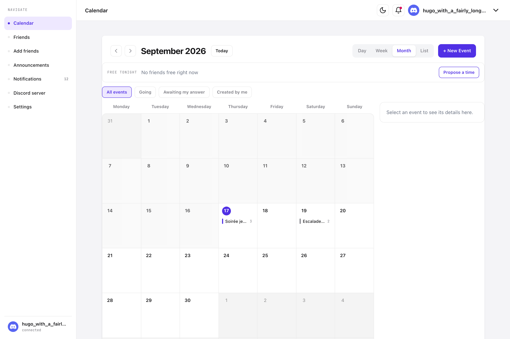
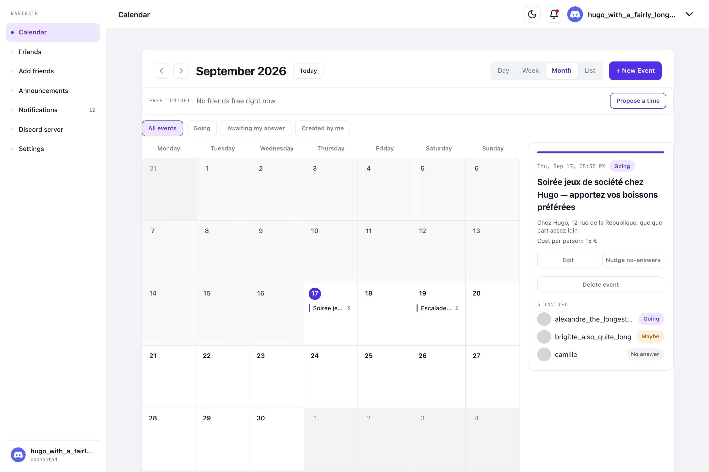
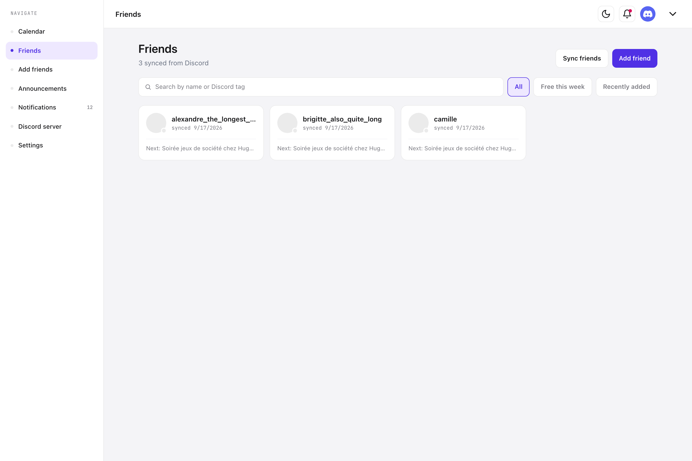
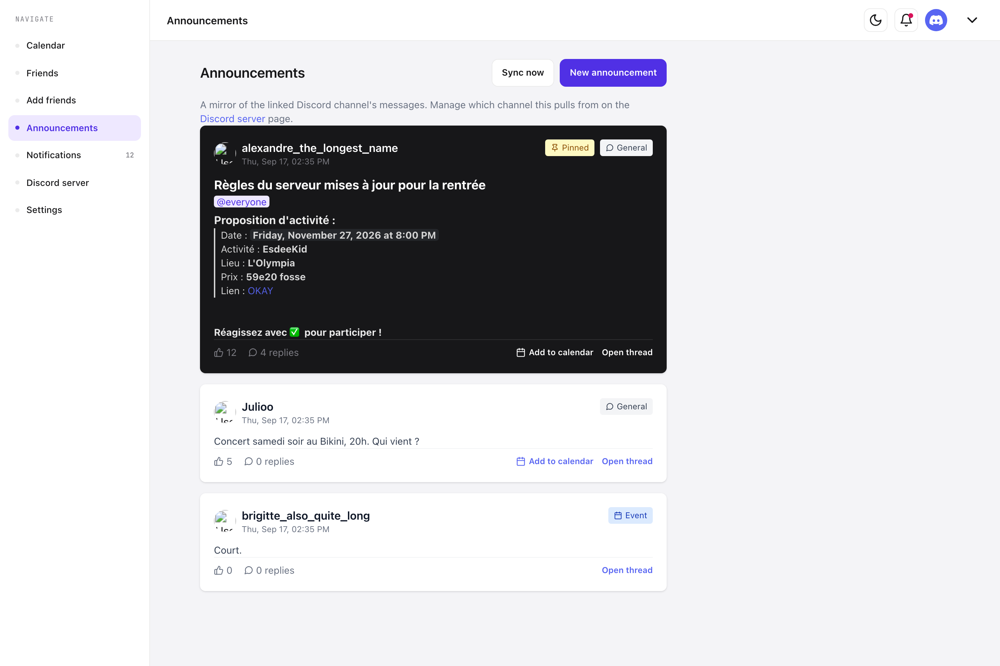
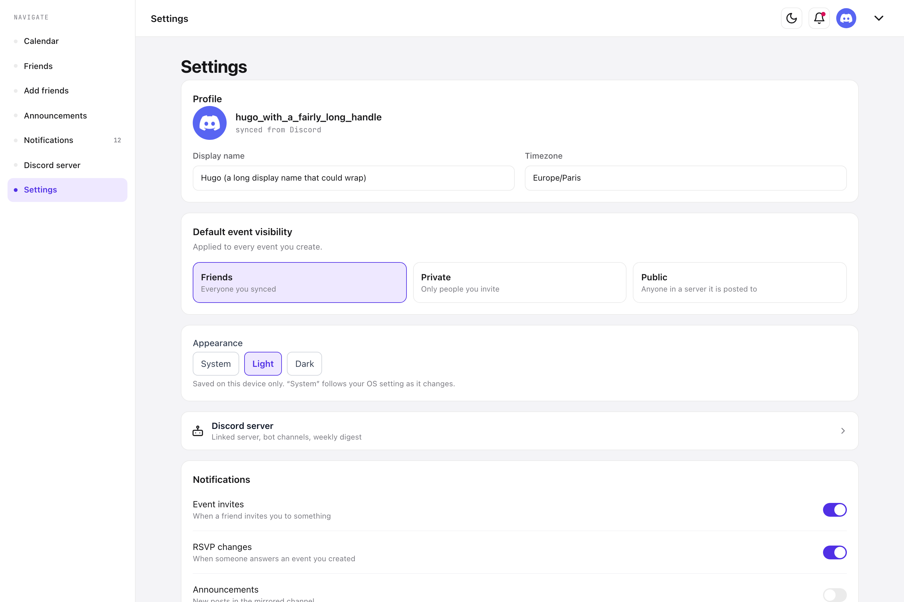
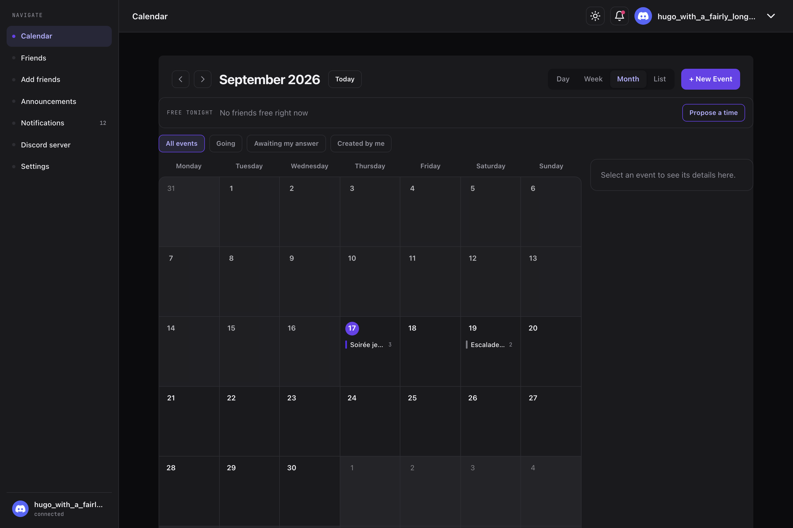
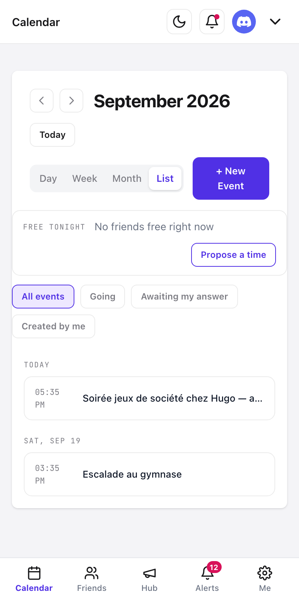
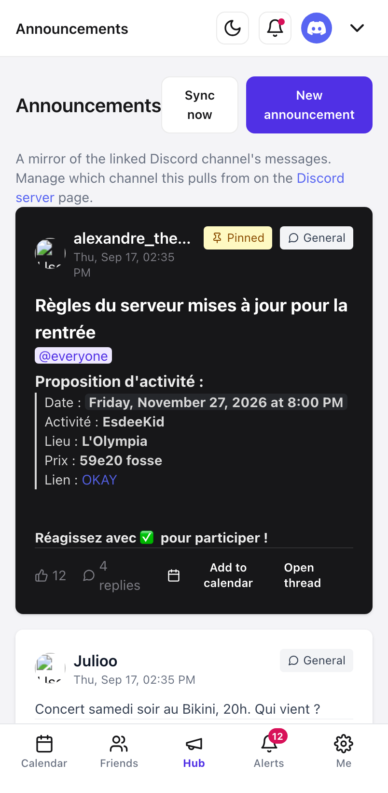

# Friends Calendar

A shared calendar for a group of friends who already live in a Discord
server. Events are created in the app, announced to Discord, and people RSVP
by reacting with ✅ — no second account, no second place to check.



---

## Screens

<table>
<tr>
<td width="50%"><b>Event detail</b> — RSVP, edit, chase the no-answers<br></td>
<td width="50%"><b>Friends</b> — synced from your server, with availability<br></td>
</tr>
<tr>
<td><b>Announcements</b> — a live mirror of a Discord channel<br></td>
<td><b>Settings</b> — profile, defaults, notifications, theme<br></td>
</tr>
<tr>
<td colspan="2"><b>Dark mode</b><br></td>
</tr>
</table>

<table>
<tr>
<td width="33%"><b>Mobile — agenda</b><br></td>
<td width="33%"><b>Mobile — hub</b><br></td>
<td width="34%" valign="top"><br>Below <code>md:</code> the sidebar becomes a bottom tab bar, the event panel becomes a sheet, and the calendar offers a list view — a seven-column grid gets about 52px per day at 402px.</td>
</tr>
</table>

---

## Features

Everything listed without a **Soon** tag is implemented and covered by tests.
**Soon** means designed but not built.

### Calendar & events

- **Month, week, day and list views** — list is the one that works on a phone.
- **Create, edit and delete events** — one form for all three.
- **RSVP** — Going / Maybe / Can't, from the calendar, the event sheet, or a notification.
- **Visibility** — private, friends, or public, scoped to the servers an event was announced in.
- **Filters** — all events, going, awaiting my answer, created by me.
- **Tap a day** to list what's on it; **long-press** (or double-click) an empty day to start an event there.
- **Reminders** — several lead times per event, delivered in-app and into the event's Discord thread.
- **Nudge no-answers** — chase the people who never replied, once a day at most.
- **Soon** · Swipe the month grid sideways, pull-to-refresh, swipe a row to RSVP.

### Finding a time

- **Free tonight** — who has nothing on right now.
- **Best overlap this week** — the app works out when most of you are free, and "Propose a time" opens the form on that slot.
- **Free this week** — per-friend availability across the coming week.
- **Soon** · Per-user timezones. Times render in the reader's browser zone today, and the timezone on your profile is stored but not yet used.

### Friends

- **Synced from Discord** — two people are friends if they share the server the bot lives in.
- **Friend requests** — send by username, accept or decline in one tap.
- **Invite people who aren't on the app yet** — posts an invite into the channel.
- **Filter** — everyone, free this week, recently added.
- **Friend profile** — their week, events you share, and one button to invite them to something.

### Discord

- **Announces events** to a channel you pick, and opens a discussion thread for each one.
- **✅ becomes an RSVP**, live — plus a backfill that picks up reactions added while the bot was offline.
- **Adopt an existing announcement** — turn a post somebody wrote by hand into a real event, keeping the reactions already on it.
- **Announcements feed** — a live mirror of the channel, with Discord markdown, custom emoji and timestamps rendered properly.
- **Post and reply as yourself** — through a webhook, so messages carry your name rather than the bot's, and can't ping the server on your behalf.
- **Channel picker** — choose from the channels the bot can see, instead of pasting an ID.
- **Multi-server** — one event, published to several servers, each with its own channel.
- **Weekly digest** — one summary message a week, if you want it.
- **Soon** · Editing which servers an event was published to after the fact.

### Notifications & settings

- **In-app feed** with an unread badge, grouped by recency.
- **Answer an invitation inline** from the notification itself.
- **Per-kind preferences** — invites, RSVP changes, announcements, reminders, and whether the bot may DM you.
- **Profile** — display name and default event visibility.
- **Light, dark and system themes**, remembered per device.
- **Delete your account**, and everything attached to it.

### Platform

- **Subscribe from Google, Apple or Outlook** — a read-only `.ics` feed of your events, with a link you can revoke.
- **Responsive** — sidebar and side panel on desktop, bottom tabs and sheets on a phone.
- **Soon** · Reading *your* calendar back, so availability accounts for work meetings too.
- **Soon** · Packaged desktop app — a Tauri shell exists in the repo but isn't built or tested in CI.

---

## Stack

|              |                                                                                                                              |
| ------------ | ---------------------------------------------------------------------------------------------------------------------------- |
| **Backend**  | Rust · [axum](https://github.com/tokio-rs/axum) · [sqlx](https://github.com/launchbadge/sqlx) · PostgreSQL                   |
| **Discord**  | [serenity](https://github.com/serenity-rs/serenity) for the gateway, `reqwest` for everything else                           |
| **Frontend** | SvelteKit · TypeScript · Tailwind v4                                                                                         |
| **Tests**    | `cargo test` (unit / `sqlx::test` / `wiremock` / functional through the real router), `vitest` + Testing Library, Playwright |
| **Infra**    | Proxmox LXC behind a Cloudflare tunnel, deployed by GitHub Actions                                                           |

---

## Running it

You'll need Rust, Node 22+, PostgreSQL, and a Discord application.

```bash
# 1. Backend
cd backend
cp .env.example .env          # fill in DATABASE_URL, DISCORD_*, JWT_SECRET
cargo run                     # migrations run on boot

# 2. Frontend
cd desktop
yarn install
yarn dev
```

The bot needs the **Server Members Intent** enabled in the Discord developer
portal, and the invite link on the `/servers` page grants the permissions it
needs.

## Tests

```bash
cd backend  && DATABASE_URL=… cargo test    # 242
cd desktop  && yarn test                    # 256
cd desktop  && yarn test:layout             # 179, real Chromium at 3 widths
```

The browser tier exists because the component tier can't see layout: every
geometry property is `0` under happy-dom, so "does this overflow at 402px"
and "is this control on screen" are unanswerable there.

## Docs

- [`CLAUDE.md`](CLAUDE.md) — how the project is actually put together, including
  the decisions and the traps. Start here before changing anything.
- [`docs/deployment.md`](docs/deployment.md) — how it gets to the server.
- [`.claude/skills/`](.claude/skills/) — one runnable playbook per feature area.
